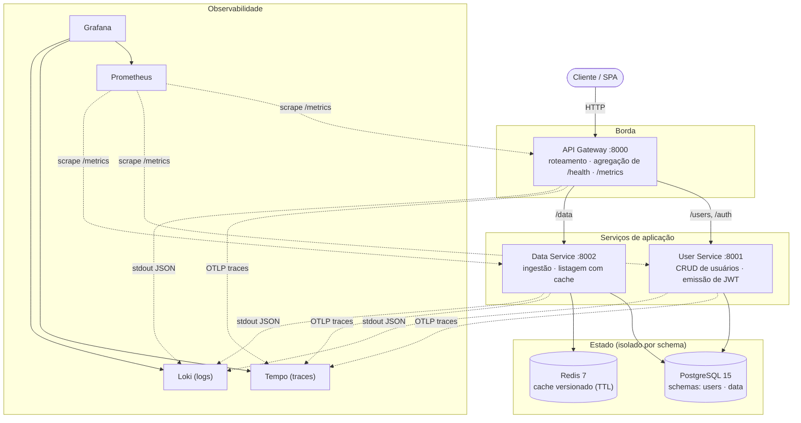
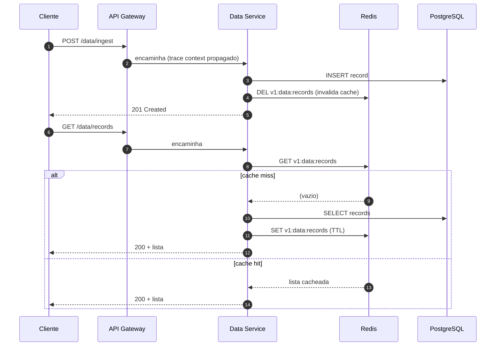
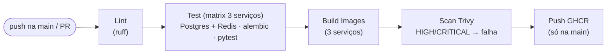

# microservices-fastapi-platform

[](https://github.com/andersonmoura87/microservices-fastapi-platform/actions/workflows/ci.yml)
[](https://www.python.org/)
[](https://fastapi.tiangolo.com/)
[](https://www.postgresql.org/)
[](https://redis.io/)
[](https://www.docker.com/)
[](https://kubernetes.io/)
[](https://prometheus.io/)
[](https://opentelemetry.io/)
[](https://grafana.com/)

Uma plataforma de microsserviços pronta para produção, construída com FastAPI, Docker, PostgreSQL, Redis e GitHub Actions CI/CD.

## Arquitetura

Diagrama de contêineres (estilo C4 — nível 2). O cliente só fala com o API Gateway;
os serviços são isolados por schema próprio no Postgres e nunca se chamam diretamente.



Cada serviço é totalmente isolado — schema de banco de dados independente, container independente e endpoint de health independente.

### Fluxo de uma requisição (ingestão + cache)

Sequência do `POST /data/ingest` seguido de `GET /data/records`, mostrando a invalidação
de cache na escrita e o caminho de leitura (miss → popula cache, hit → serve do Redis).



## Stack

| Camada | Tecnologia |
|---|---|
| API | FastAPI 0.111 + Python 3.11 |
| ORM | SQLAlchemy 2.0 + Alembic |
| Banco de dados | PostgreSQL 15 |
| Cache | Redis 7 |
| Containers | Docker + Docker Compose |
| Orquestração | Kubernetes (Kustomize: base + overlays dev/prod) |
| Métricas | Prometheus (`/metrics` em cada serviço) |
| Tracing | OpenTelemetry → Tempo |
| Logs | structlog (JSON) → Loki via Promtail |
| Dashboards | Grafana (datasources provisionados) |
| CI/CD | GitHub Actions + Trivy + Dependabot |

## Início Rápido

```bash
git clone https://github.com/andersonmoura87/microservices-fastapi-platform
cd microservices-fastapi-platform

cp .env.example .env
docker compose up --build
```

Os serviços ficarão disponíveis em:

- API Gateway → http://localhost:8000
- Swagger UI  → http://localhost:8000/docs
- Prometheus  → http://localhost:9090
- Grafana     → http://localhost:3000 (admin / admin)

## Endpoints da API

### Usuários
```
POST   /users           Criar usuário
GET    /users/{id}      Buscar usuário por ID
PUT    /users/{id}      Atualizar usuário
DELETE /users/{id}      Remover usuário
```

### Autenticação
```
POST   /auth/token      Emite um JWT para um usuário existente (por e-mail)
```

### Dados
```
POST   /data/ingest     Ingerir um registro
GET    /data/records    Listar registros (cacheado via Redis)
GET    /data/{id}       Buscar registro por ID
```

### Plataforma
```
GET    /health          Healthcheck agregado (gateway + todos os serviços)
GET    /metrics         Métricas do Prometheus
```

## Estrutura do Projeto

```
microservices-fastapi-platform/
├── services/
│   ├── api-gateway/
│   │   ├── app/
│   │   │   ├── main.py
│   │   │   ├── config.py
│   │   │   ├── logging_config.py
│   │   │   └── tracing.py
│   │   ├── tests/
│   │   ├── Dockerfile
│   │   ├── .dockerignore
│   │   └── requirements.txt
│   ├── user-service/
│   │   ├── app/
│   │   │   ├── main.py
│   │   │   ├── config.py
│   │   │   ├── logging_config.py
│   │   │   ├── tracing.py
│   │   │   ├── auth.py
│   │   │   ├── models.py
│   │   │   ├── schemas.py
│   │   │   ├── crud.py
│   │   │   └── database.py
│   │   ├── alembic/
│   │   │   ├── env.py
│   │   │   └── versions/
│   │   ├── tests/
│   │   ├── alembic.ini
│   │   ├── entrypoint.sh
│   │   ├── Dockerfile
│   │   └── requirements.txt
│   └── data-service/
│       ├── app/
│       │   ├── main.py
│       │   ├── config.py
│       │   ├── logging_config.py
│       │   ├── tracing.py
│       │   ├── models.py
│       │   ├── schemas.py
│       │   ├── crud.py
│       │   ├── cache.py
│       │   └── database.py
│       ├── alembic/
│       ├── tests/
│       ├── alembic.ini
│       ├── entrypoint.sh
│       ├── Dockerfile
│       └── requirements.txt
├── infra/
│   ├── postgres/
│   │   └── init.sql
│   ├── prometheus/
│   │   └── prometheus.yml
│   ├── tempo/
│   │   └── tempo.yaml
│   ├── loki/
│   │   └── loki-config.yaml
│   ├── promtail/
│   │   └── promtail-config.yaml
│   └── grafana/
│       ├── datasources/
│       └── dashboards/
├── deploy/
│   └── k8s/
│       ├── base/
│       └── overlays/
│           ├── dev/
│           └── prod/
├── .github/
│   ├── workflows/
│   │   └── ci.yml
│   └── dependabot.yml
├── docker-compose.yml
├── Makefile
├── ruff.toml
├── .env.example
└── README.md
```

## Pipeline de CI/CD



O pipeline roda a cada push para a `main` e em todos os pull requests. O job de testes
roda em **matrix** pelos três serviços, sobe Postgres + Redis como serviços do GitHub Actions
e aplica as migrations (`alembic upgrade head`) antes do `pytest`. O `build` só publica a imagem
no GHCR se o scan de vulnerabilidades do Trivy passar (falha em HIGH/CRITICAL com fix disponível).
O `dependabot` mantém as dependências pip, as imagens Docker e as GitHub Actions atualizadas.

## Observabilidade

Os três pilares (métricas, traces e logs) ficam no mesmo Grafana, com datasources
provisionados automaticamente — nada de configuração manual.

**Métricas (Prometheus).** Cada serviço expõe `/metrics`; o Prometheus coleta os três a cada
15s. O dashboard provisionado mostra:

- Taxa de requisições por serviço
- Latência de resposta P95 por serviço
- Razão de cache hit/miss (data-service)
- Taxa de respostas 5xx por serviço

**Tracing (OpenTelemetry → Tempo).** FastAPI e o cliente httpx do gateway são instrumentados
com OpenTelemetry; o trace context é propagado gateway → serviços, então um `POST /data/ingest`
aparece como um único trace ponta-a-ponta. O exporter usa OTLP/HTTP e só liga se
`OTEL_EXPORTER_OTLP_ENDPOINT` estiver definido (zero overhead quando ausente, ex.: em testes).

**Logs (structlog → Loki).** Os logs saem em **JSON estruturado** no stdout; o Promtail coleta
os logs dos containers e envia ao Loki. Cada log carrega `trace_id`/`span_id`, e o Grafana está
configurado para **pivotar de um log direto para o trace correspondente** no Tempo (e vice-versa).

## Variáveis de Ambiente

Copie `.env.example` para `.env` e ajuste conforme necessário:

```env
POSTGRES_USER=platform
POSTGRES_PASSWORD=changeme
POSTGRES_DB=platform
REDIS_URL=redis://redis:6379/0
CACHE_TTL=300
JWT_SECRET=change-this-in-production
LOG_LEVEL=INFO
OTEL_EXPORTER_OTLP_ENDPOINT=http://tempo:4318
```

## Migrations

O schema é gerenciado com **Alembic** — `create_all` não é usado em runtime. Cada serviço com
banco tem o seu próprio histórico de migrations em `alembic/versions/` e roda
`alembic upgrade head` no `entrypoint.sh` antes de subir o Uvicorn, garantindo que o container
nunca atende tráfego com o schema desatualizado.

```bash
# Gerar uma nova migration a partir das mudanças nos models
cd services/user-service
alembic revision --autogenerate -m "add phone column"

# Aplicar nos containers em execução
make migrate
```

## Executando os Testes

```bash
# Todos os serviços de uma vez
make test

# Ou um serviço específico (requer postgres + redis em execução)
cd services/user-service
pip install -r requirements.txt
pytest tests/ -v
```

## Comandos (Makefile)

```bash
make up        # build + sobe a stack (detached)
make down      # derruba a stack
make logs      # tail dos logs
make lint      # ruff em todos os serviços
make test      # roda os testes de todos os serviços
make migrate   # aplica as migrations nos containers
make clean     # derruba a stack e remove os volumes
```

## Kubernetes

Os manifests vivem em `deploy/k8s/` usando **Kustomize** (base + overlays por ambiente),
sem precisar de Helm. A base traz, para cada serviço de aplicação:

- `Deployment` com **RollingUpdate** `maxUnavailable: 0` (zero-downtime)
- `readinessProbe` + `livenessProbe` em `/health`
- `resources.requests` e `resources.limits`
- `securityContext` endurecido: non-root, `readOnlyRootFilesystem`, `drop: [ALL]`, seccomp `RuntimeDefault`
- `HorizontalPodAutoscaler` (CPU 70%) e `PodDisruptionBudget`
- `Service` interno + `Ingress` (nginx) expondo só o gateway

Os overlays ajustam réplicas/recursos por ambiente; `prod` ainda fixa as imagens em uma tag
imutável (`v1.0.0`) em vez de `:latest`.

```bash
# Renderizar e revisar o que seria aplicado
kubectl kustomize deploy/k8s/overlays/dev

# Aplicar em um cluster (ex.: kind / minikube)
kubectl apply -k deploy/k8s/overlays/dev
kubectl apply -k deploy/k8s/overlays/prod
```

> Segredos aqui são apenas valores de demonstração. Em um cluster real eles viriam de um
> gerenciador externo (External Secrets Operator / Vault / SOPS), nunca versionados em texto puro.
> As migrations rodam pelo `entrypoint` da imagem; em produção, o ideal é promovê-las a um
> `Job`/hook de pré-deploy para evitar corrida entre réplicas.

## Segurança

- Containers rodam como usuário **não-root** (`appuser`), com build **multi-stage** para imagem enxuta
- No Kubernetes: `readOnlyRootFilesystem`, `allowPrivilegeEscalation: false`, `drop: [ALL]` e seccomp `RuntimeDefault`
- Imagens são escaneadas com **Trivy** no CI; HIGH/CRITICAL com fix disponível **quebram o build**
- Segredos só via variáveis de ambiente / `pydantic-settings` — nunca hardcoded
- **Dependabot** abre PRs semanais para pip, Docker e GitHub Actions
- Logs **estruturados em JSON** com `structlog`, correlacionados a traces via `trace_id`

## Decisões de Design

**Por que uma única instância PostgreSQL com schemas separados em vez de bancos separados?**
É mais fácil de operar em um setup de nó único, mantendo ainda o isolamento lógico. Em um ambiente de produção real, cada serviço teria sua própria instância de banco de dados.

**Por que Redis para cache no data-service?**
O padrão de consultas do data-service é predominantemente de leitura (read-heavy). O cache baseado em TTL do Redis evita acessos redundantes ao banco para registros consultados com frequência, reduzindo significativamente a latência p95.

**Por que httpx para chamadas entre serviços no gateway?**
O httpx suporta async nativamente, o que mantém o gateway não bloqueante mesmo ao distribuir chamadas (fan-out) para múltiplos serviços downstream no endpoint de agregação `/health`.

**Por que OpenTelemetry + Tempo/Loki em vez de só métricas?**
Métricas dizem *que* algo está lento, mas não *onde*. Com tracing distribuído dá pra seguir uma
requisição pelo gateway até o banco em um único trace, e o `trace_id` nos logs fecha o ciclo:
de um alerta no Prometheus → trace no Tempo → logs daquela request no Loki, tudo no mesmo Grafana.

**Por que Kustomize em vez de Helm?**
Para esta plataforma, overlays declarativos (sem templating/`values.yaml`) deixam o diff por
ambiente explícito e legível, e casam bem com fluxo GitOps. Helm faria mais sentido se a intenção
fosse empacotar e distribuir o chart para terceiros.

## Contribuindo

1. Faça um fork do repositório
2. Crie uma branch de feature (`git checkout -b feat/sua-feature`)
3. Faça commits das suas alterações seguindo o padrão [Conventional Commits](https://www.conventionalcommits.org/)
4. Faça push e abra um Pull Request
